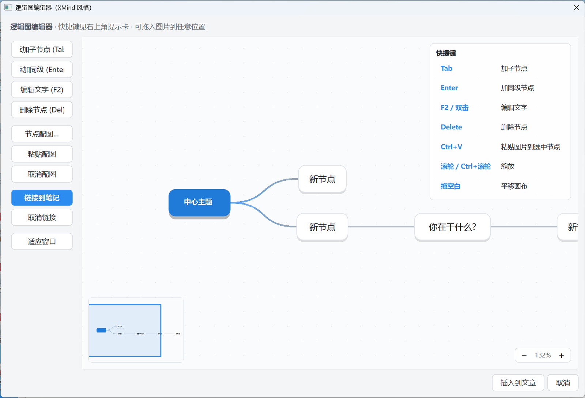

# 欢迎使用我的博客


```mindmap
- 中心主题
  -  新节点
  - 新节点
    - 你在干什么?
      - 新节点
        - 新节点
```


## 你好，高军军

这是你的第一篇文章。它是由「博客助手」软件自动发布的——你不需要敲任何命令，所有同步工作都由软件完成。

<!--more-->


## 怎么写文章

1. 在博客助手软件里点击 **「新建文章」**，或者直接把本地写好的 Markdown 文件 **拖进软件窗口**
2. 在编辑器里写作，右侧可以实时预览效果
3. 点击 **「发布」**，文章会自动同步到网站，大约 1 分钟后即可在线访问

没写完的文章可以存为 **草稿**，草稿不会发布到网站上。

## Markdown 效果演示

### 代码块

```python
def hello():
    print("你好，博客！")

hello()
```

---

### 引用

> 笔记的意义，在于把学过的东西真正变成自己的。


### 列表

- 支持任务列表
- 支持数学公式（在文章设置里开启）
- 支持图片灯箱、代码高亮、文章目录

1. 有序列表一
2. 有序列表二
3. 有序列表三

### 表格

| 功能 | 是否支持 |
| --- | :---: |
| Markdown 编辑 | ✅ |
| 实时预览 | ✅ |
| 一键发布 | ✅ |
| 草稿机制 | ✅ |

### 数学公式

块级公式（在文章设置中开启「数学公式」后生效）：

$$ E = mc^2 $$

---

这篇文章发布成功后，就说明你的博客已经完全正常工作了。你可以在软件里删除它，然后开始写自己的笔记。

